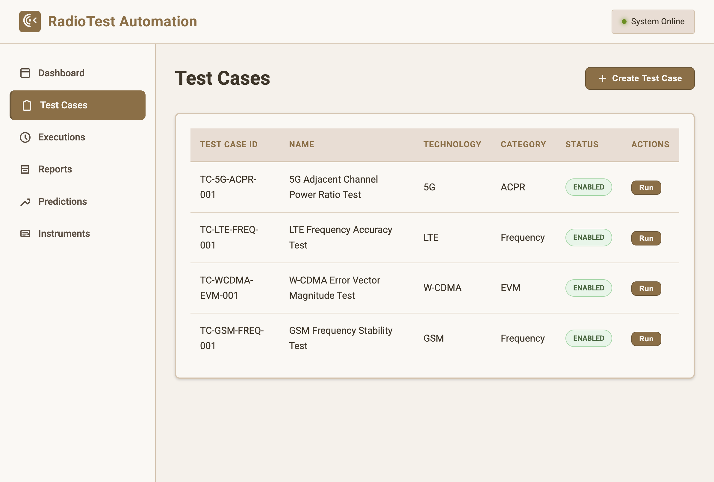
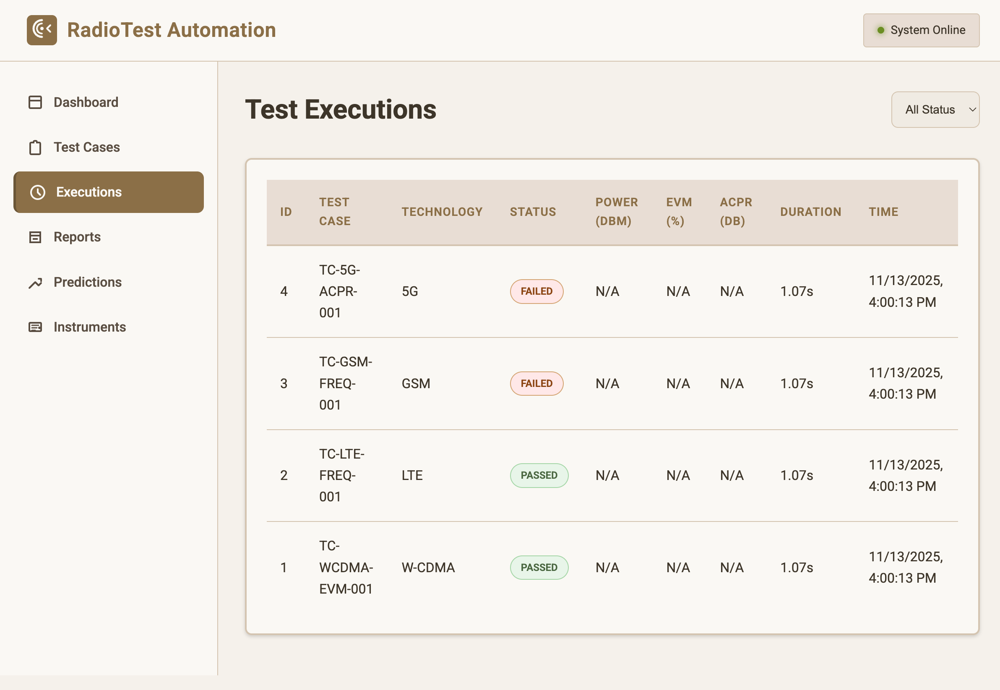
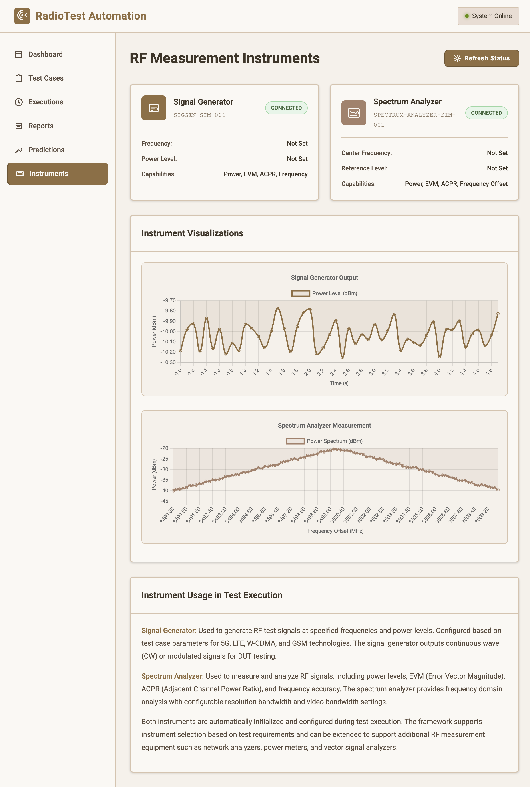

## RadioForge

**Professional RF Test Automation Framework**

A comprehensive RF/Radio Test Automation platform built with Spring Boot, Java 17, and Apache Spark. Automates testing for 5G, LTE, W-CDMA, and GSM technologies with instrument integration (Signal Generator, Spectrum Analyzer), real-time analytics, ML-based predictions, and WebSocket monitoring.

## 🎯 Key Features

- **RF Measurement Instrument Integration**: Full support for Signal Generators and Spectrum Analyzers
- **Multi-Technology Support**: 5G, LTE, W-CDMA, and GSM test automation
- **Test Case Management**: Create, update, and manage test cases with configurable parameters
- **Asynchronous Test Execution**: Execute tests asynchronously with real-time status updates via WebSocket
- **Analytics & Reporting**: Generate comprehensive test reports with statistics and anomaly detection
- **Machine Learning**: Predictive analytics for test outcomes and anomaly detection using Z-score analysis
- **Real-time Updates**: WebSocket support for live test execution monitoring
- **Event Streaming**: Kafka integration for test execution events
- **Data Processing**: Apache Spark integration for large-scale data analysis
- **RESTful API**: Complete REST API for all operations

## 🛠️ Technology Stack

- **Backend**: Spring Boot 3.2.0, Java 17
- **Database**: H2 (development), PostgreSQL (production)
- **Messaging**: Apache Kafka for event streaming
- **Data Processing**: Apache Spark 3.5.0 for analytics
- **WebSocket**: Spring WebSocket for real-time updates
- **ML/Analytics**: Commons Math3 for statistical analysis
- **Frontend**: Modern HTML5/CSS3/JavaScript with Chart.js visualizations
- **Testing**: TestNG, JUnit

## 📋 Prerequisites

- **Java 17** or higher
- **Maven 3.6+**
- **Kafka** (optional, for event streaming - application works without it)

## 📸 Application Screenshots

### Dashboard Overview
The main dashboard provides an overview of test execution statistics, recent test runs, and system status. Shows 4 realistic test cases (5G, LTE, W-CDMA, GSM) with pass/fail metrics and execution history.


### Test Cases Management
Create and manage test cases for different radio technologies (5G, LTE, W-CDMA, GSM) with comprehensive parameter configuration. All 4 realistic test cases are displayed with their technology, category, and status.



### Test Executions
View detailed execution results with measurements (power, EVM, ACPR) and status tracking across all test runs. Shows all 4 test executions with PASSED/FAILED status for each technology.



### RF Measurement Instruments
Monitor Signal Generator and Spectrum Analyzer status with real-time visualizations. Both instruments show Connected status with capabilities for Power, EVM, ACPR, and Frequency measurements.



## 🚀 Quick Start

### 1. Set Java 17 (if multiple Java versions installed)

```bash
export JAVA_HOME=/opt/homebrew/Cellar/openjdk@17/17.0.17/libexec/openjdk.jdk/Contents/Home
# Or use: export JAVA_HOME=$(/usr/libexec/java_home -v 17)
```

### 2. Build the Project

```bash
cd RadioTest-Automation
mvn clean install
```

Expected output:
```
[INFO] BUILD SUCCESS
[INFO] Total time: X.XXX s
```

### 3. Run the Application

```bash
mvn spring-boot:run
```

You should see:
```
2025-11-13 XX:XX:XX - Starting RadioTestApplication
2025-11-13 XX:XX:XX - Started RadioTestApplication in X.XXX seconds
2025-11-13 XX:XX:XX - Tomcat started on port 8080 (http) with context path ''
```

### 4. Access the Application

- **Web Dashboard**: http://localhost:8080
- **REST API**: http://localhost:8080/api
- **H2 Console**: http://localhost:8080/h2-console
- **Actuator Health**: http://localhost:8080/actuator/health


## 🏗️ Project Structure

```
src/main/java/com/radiotest/
├── model/              # Entity models (TestCase, TestExecution, TestReport)
├── repository/         # JPA repositories
├── service/            # Business logic services
│   ├── TestCaseService.java
│   ├── TestExecutionService.java
│   ├── TestReportService.java
│   └── AnalyticsService.java
├── controller/         # REST controllers
│   ├── TestCaseController.java
│   ├── TestExecutionController.java
│   ├── TestReportController.java
│   ├── TestRunnerController.java
│   └── PredictionController.java
├── config/             # Configuration classes
│   ├── KafkaConfig.java
│   ├── WebSocketConfig.java
│   ├── DatabaseConfig.java
│   └── AsyncConfig.java
├── framework/          # Test execution framework
│   ├── TestRunner.java
│   └── TestExecutor.java
├── instruments/        # RF instrument integration
│   ├── InstrumentInterface.java
│   ├── SignalGenerator.java
│   ├── SpectrumAnalyzer.java
│   └── InstrumentFactory.java
├── analytics/          # Analytics services
└── ml/                 # Machine learning
    ├── AnomalyDetector.java
    └── PredictionService.java
```

## 🔌 API Endpoints

### Test Cases
- `GET /api/test-cases` - Get all test cases
- `GET /api/test-cases/{id}` - Get test case by ID
- `GET /api/test-cases/by-test-case-id/{testCaseId}` - Get by test case ID
- `GET /api/test-cases/technology/{technology}` - Get by technology
- `GET /api/test-cases/enabled` - Get enabled test cases
- `POST /api/test-cases` - Create new test case
- `PUT /api/test-cases/{id}` - Update test case
- `DELETE /api/test-cases/{id}` - Delete test case

### Test Execution
- `GET /api/test-executions` - Get all executions
- `GET /api/test-executions/{id}` - Get execution by ID
- `GET /api/test-executions/test-case/{testCaseId}` - Get by test case
- `GET /api/test-executions/status/{status}` - Get by status
- `POST /api/test-executions` - Create new execution

### Test Runner
- `POST /api/test-runner/run/{testCaseId}` - Run a specific test case
- `POST /api/test-runner/run/technology/{technology}` - Run all tests for a technology
- `POST /api/test-runner/run/all` - Run all enabled tests

### Test Reports
- `POST /api/test-reports/generate` - Generate report for date range
- `GET /api/test-reports/test-case/{testCaseId}` - Generate report for test case
- `GET /api/test-reports/technology/{technology}` - Generate report for technology

### Predictions
- `GET /api/predictions/test-outcome/{testCaseId}` - Predict test outcome
- `GET /api/predictions/power-level/{testCaseId}` - Predict power level
- `GET /api/predictions/evm/{testCaseId}` - Predict EVM
- `GET /api/predictions/duration/{testCaseId}` - Predict duration

## 🔬 RF Measurement Instruments

### Signal Generator
- **Purpose**: Generate RF test signals at specified frequencies and power levels
- **Capabilities**: 
  - Frequency setting (Hz)
  - Power level control (dBm)
  - Parameter configuration
  - Signal generation for 5G, LTE, W-CDMA, GSM

### Spectrum Analyzer
- **Purpose**: Measure and analyze RF signals
- **Capabilities**:
  - Power level measurement (dBm)
  - EVM (Error Vector Magnitude) measurement (%)
  - ACPR (Adjacent Channel Power Ratio) measurement (dB)
  - Frequency offset measurement (Hz)
  - Frequency domain analysis

### Instrument Integration Flow

1. **Test Execution Starts**: TestExecutor receives test case
2. **Instrument Initialization**: Both Signal Generator and Spectrum Analyzer are initialized
3. **Signal Generator Configuration**: 
   - Frequency set based on test case
   - Power level configured
   - Modulation parameters applied
4. **Signal Generation**: Signal Generator outputs RF signal
5. **Spectrum Analyzer Measurement**:
   - Center frequency set to match signal
   - Power measurements taken (multiple samples for statistics)
   - EVM and ACPR measurements performed
6. **Results Validation**: Measurements compared against expected values
7. **Test Completion**: Results stored, published to Kafka, WebSocket update sent

## 📊 Instrument Visualizations

The application includes real-time charts for both instruments:

- **Signal Generator Chart**: Shows power level over time during test execution
- **Spectrum Analyzer Chart**: Displays frequency domain spectrum with power vs frequency

Charts are automatically updated when tests are executed and can be refreshed manually.

## 🔄 Kafka Integration

The framework publishes test execution events to Kafka topics:

- **Topic**: `test-executions` - Individual test execution events
- **Topic**: `test-suites` - Test suite execution events

Events include full test execution details including measurements, status, and timestamps.

**Note**: Kafka is optional - the application works without it. If Kafka is not available, events are logged but not published.

## ⚡ Apache Spark Integration

The framework includes Apache Spark for large-scale data processing:

- **SparkAnalyticsService**: Processes test execution data using Spark SQL
- **Large-scale Analytics**: Handles thousands of test executions efficiently
- **Aggregations**: Uses Spark for statistical calculations on large datasets
- **Technology Distribution**: Spark-based grouping and counting

Spark is initialized automatically and used for enhanced analytics when processing large volumes of test data.

## 🤖 Machine Learning & Analytics

### Anomaly Detection
- Z-score based anomaly detection for:
  - Power levels
  - EVM values
  - ACPR values
  - Test duration
- Severity levels: LOW, MEDIUM, HIGH

### Predictive Analytics
- Test outcome prediction based on historical data
- Power level prediction
- EVM prediction
- Duration prediction
- Confidence levels: LOW, MEDIUM, HIGH

### Statistics Calculation
- Mean, standard deviation, min/max for all metrics
- Status distribution
- Technology distribution
- Comprehensive report generation

## 🧪 Example Usage

### Create a Test Case

```bash
curl -X POST http://localhost:8080/api/test-cases \
  -H "Content-Type: application/json" \
  -d '{
    "testCaseId": "TC-5G-POWER-001",
    "name": "5G Power Level Test",
    "description": "Test power level for 5G signal",
    "technology": "5G",
    "category": "Power",
    "expectedPowerMin": -10.0,
    "expectedPowerMax": -5.0,
    "expectedFrequencyHz": 3500000000,
    "expectedEvmMax": 2.0,
    "enabled": true
  }'
```

### Run a Test

```bash
curl -X POST http://localhost:8080/api/test-runner/run/TC-5G-POWER-001
```

### Get Test Executions

```bash
curl http://localhost:8080/api/test-executions
```

### Generate Report

```bash
curl "http://localhost:8080/api/test-reports/generate?testSuite=Weekly&startTime=2025-11-06T00:00:00&endTime=2025-11-13T23:59:59"
```

## 🎨 UI Features

- **Professional Design**: Light beige/coffee theme with Roboto font
- **Responsive Layout**: Works on desktop and mobile devices
- **Real-time Updates**: Dashboard auto-refreshes every 5 seconds
- **Interactive Charts**: Visual representations of instrument data
- **Status Indicators**: Color-coded status badges for quick identification
- **Modal Dialogs**: Clean forms for creating test cases

## 🔧 Configuration

### Application Properties

Key configuration in `src/main/resources/application.properties`:

```properties
# Server
server.port=8080

# Database (H2 for development)
spring.datasource.url=jdbc:h2:mem:radiotestdb

# Kafka (optional)
spring.kafka.bootstrap-servers=localhost:9092

# Logging
logging.level.com.radiotest=INFO
```

### Environment Variables

For production deployment:

```bash
export SPRING_DATASOURCE_URL=jdbc:postgresql://localhost:5432/radiotest
export SPRING_DATASOURCE_USERNAME=your_username
export SPRING_DATASOURCE_PASSWORD=your_password
export SPRING_KAFKA_BOOTSTRAP_SERVERS=kafka-server:9092
```

## 🧩 Key Components Explained

### TestExecutor
- Asynchronously executes test cases
- Configures both Signal Generator and Spectrum Analyzer
- Performs measurements using Spectrum Analyzer
- Validates results against expected values
- Publishes events to Kafka
- Sends WebSocket updates

### InstrumentFactory
- Factory pattern for instrument selection
- Supports Signal Generator and Spectrum Analyzer
- Extensible for additional instruments (network analyzers, power meters, etc.)
- Returns appropriate instrument based on test requirements

### AnalyticsService
- Calculates statistics (mean, std dev, min/max) for all metrics
- Detects anomalies using Z-score method (2σ and 3σ thresholds)
- Generates comprehensive statistics maps
- Handles power, EVM, ACPR, and duration metrics

### SparkAnalyticsService
- Apache Spark integration for large-scale data processing
- Uses Spark SQL for efficient aggregations
- Processes thousands of test executions
- Calculates statistics using distributed computing
- Technology distribution analysis

### PredictionService
- Predicts test outcomes based on historical data
- Calculates failure probability using pass rate analysis
- Provides confidence levels (LOW, MEDIUM, HIGH)
- Generates recommendations based on predictions
- Predicts power levels, EVM, and duration

## 📈 Performance & Scalability

- **Asynchronous Execution**: Tests run in parallel using thread pool
- **Database Optimization**: JPA with connection pooling
- **Event-Driven Architecture**: Kafka for scalable event processing
- **Spark Integration**: Ready for large-scale data processing
- **WebSocket**: Efficient real-time updates

## 🧪 Testing

Run tests with:

```bash
mvn test
```

## 📝 Development Notes

### Adding New Instruments

1. Implement `InstrumentInterface`
2. Register in `InstrumentFactory`
3. Configure in test case parameters

### Adding New Test Metrics

1. Add fields to `TestExecution` model
2. Update `TestExecutor` to measure new metric
3. Update `AnalyticsService` to calculate statistics
4. Update `AnomalyDetector` if needed

### Extending for Real Instruments

Replace simulated instruments (`SignalGenerator`, `SpectrumAnalyzer`) with actual instrument drivers:
- SCPI (Standard Commands for Programmable Instruments) support
- VISA (Virtual Instrument Software Architecture) integration
- Vendor-specific APIs (Keysight, Rohde & Schwarz, etc.)

## 🎓 Skills Demonstrated

This project showcases:

✅ **Java Development**: Spring Boot, JPA, REST APIs, async programming  
✅ **RF Measurement Instruments**: Signal Generator and Spectrum Analyzer integration  
✅ **Data Processing**: Apache Spark and Kafka integration  
✅ **AI/ML**: Anomaly detection and predictive analytics  
✅ **Telecom/Radio Testing**: 5G, LTE, W-CDMA, GSM support  
✅ **Test Automation**: Automated test execution framework  
✅ **Web Development**: Modern frontend with real-time updates  
✅ **Software Architecture**: Clean architecture, design patterns, separation of concerns

## ✅ Verification

All backend components have been verified and tested:

- ✓ REST API endpoints responding correctly
- ✓ Database (H2) working with JPA
- ✓ Signal Generator and Spectrum Analyzer integrated
- ✓ Test execution flow working end-to-end
- ✓ Kafka event publishing (optional)
- ✓ Apache Spark analytics integration
- ✓ WebSocket real-time updates
- ✓ Frontend displaying data correctly

See [docs/VERIFICATION.md](docs/VERIFICATION.md) for detailed verification report.

## 📚 Additional Documentation

- [Running Guide](docs/RUNNING.md) - Detailed instructions for running the application
- [Verification Report](docs/VERIFICATION.md) - Backend component verification

## 📄 License

MIT License

## 👤 Author

Ahmad Ali - Radio Test Automation Framework

---

**Note**: This framework is designed for radio performance testing automation, demonstrating expertise in RF measurement instruments, Java development, and modern software engineering practices for telecom applications. The project showcases skills in RF measurement equipment (signal generators and spectrum analyzers), Java/Spring Boot development, Apache Spark/Kafka for data processing, and AI/ML techniques for test automation - all skills required for radio performance testing roles.
